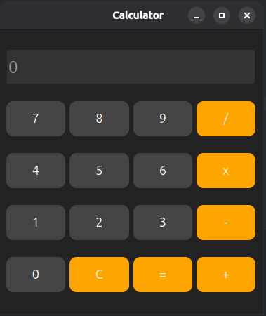

# Calculator Application

A simple and modern calculator desktop application built using **C++ and Qt6 Widgets**.

## Features

- Basic arithmetic operations:
  - Addition (+)
  - Subtraction (-)
  - Multiplication (×)
  - Division (/)

- User-friendly graphical interface
- Button-based input system
- Built using Qt Widgets framework

## Technologies Used

- C++17
- Qt6 Widgets
- CMake

### Ubuntu Installation

Install the required packages:

```bash
sudo apt install qt6-base-dev cmake build-essential
```

## Installation

### Clone this repository

```bash
git clone https://github.com/DULAKSHANA404/Calculator-in-Cpp
```

### Navigate into the project directory

```bash
cd Calculator-in-Cpp
```

### Create a build directory

```bash
mkdir build
cd build
```

### Generate build files

```bash
cmake ..
```

### Compile the project

```bash
make
```

### Run the calculator

```bash
./calculator
```

## Screenshot


